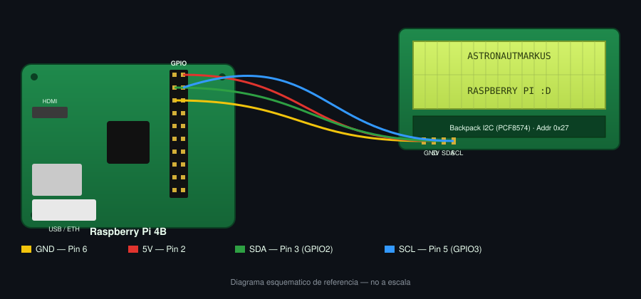

# 4B I2C Admin

Control and status dashboard for a 16x2 LCD driven over I2C (PCF8574 backpack) from a Raspberry Pi 4B, written in Python with `smbus`. Only 4 wires are needed (GND, 5V, SDA, SCL) thanks to the I2C backpack.


---

## Wiring diagram



> Custom schematic based on the physical reference of the module. It does not replace a real photo of the setup, but keeps a 1:1 pin correspondence.

---

## Pinout

| Signal | LCD (I2C backpack) | Raspberry Pi 4B | Physical pin |
|:------:|:-------------------:|:----------------:|:-------------:|
| GND    | GND                  | GND               | Pin 6         |
| VCC    | 5V                   | 5V                | Pin 2         |
| SDA    | SDA                  | GPIO2 (SDA1)      | Pin 3         |
| SCL    | SCL                  | GPIO3 (SCL1)      | Pin 5         |

---

## Hardware required

- Raspberry Pi 4B (any revision, with a 40-pin GPIO header)
- 16x2 LCD with I2C backpack (PCF8574 chip)
- 4x female-to-female jumper wires

---

## System setup

### 1. Enable the I2C bus

```bash
sudo raspi-config
# Interface Options -> I2C -> Enable
sudo reboot
```

### 2. Install system dependencies

```bash
sudo apt update
sudo apt install -y python3-smbus i2c-tools
```

### 3. Confirm the Raspberry Pi detects the module

With the LCD connected:

```bash
i2cdetect -y 1
```

You should see an address highlighted in the table (usually `0x27`, some modules use `0x3F`):

```
     0  1  2  3  4  5  6  7  8  9  a  b  c  d  e  f
00:                         -- -- -- -- -- -- -- --
10: -- -- -- -- -- -- -- -- -- -- -- -- -- -- -- --
20: -- -- -- -- -- -- -- 27 -- -- -- -- -- -- -- --
...
```

If the detected address is not `0x27`, adjust the `LCD_ADDR` constant in [lcd_i2c.py](lcd_i2c.py).

### 4. Install Python dependencies (required for the dashboard)

```bash
pip3 install -r requirements.txt
sudo apt install lm-sensors
sudo sensors-detect   # answer "yes"/enter to the default prompts
```

---

## Usage

### Basic driver

```bash
python3 lcd_i2c.py
```

The script:

1. Initializes the LCD in 4-bit mode, 2 lines.
2. Writes `"AstronautMarkus"` on line 1 and `"Raspberry Pi :D"` on line 2.
3. Stays in an infinite loop (`Ctrl+C` to exit, which clears the screen automatically).

Usage as a module:

```python
from lcd_i2c import lcd_init, lcd_message, lcd_clear, LCD_LINE_1, LCD_LINE_2

lcd_init()
lcd_message("Hello world", LCD_LINE_1)
lcd_message("From Python", LCD_LINE_2)
```

### Dashboard (HTTP + hardware + weather)

```bash
python3 dashboard.py
```

[dashboard.py](dashboard.py) rotates automatically between several screens, each with its own loading indicator while it resolves the underlying query.

| Screen | Data source | Live? |
|---|---|---|
| Clock / date | local `datetime` | Yes, rewritten every second (`TICK_SECONDS`) |
| Network | hostname + real private IP (see note below) | No, static within the window |
| Hardware | CPU %, RAM %, disk % (`psutil`) + CPU temperature (`lm-sensors`, `sensors -u`) | Yes, re-read every second |
| Weather | IP-based geolocation ([ipwho.is](https://ipwho.is), no API key) + current weather ([Open-Meteo](https://open-meteo.com), no API key) | Cached, refreshed every `WEATHER_REFRESH_EVERY` cycles |
| Chile holidays | [boostr.cl](https://boostr.cl/feriados) — celebrates with an animation if today is a holiday; otherwise shows the next one and the days remaining | Queried once per year (cached in `state["holidays_year"]`) |

Designed as an extensible base: adding a new screen just requires a new name in `SCREENS` and a `screen_xxx()` function.

> If there is no internet connection, the network/weather/holidays screens show a notice instead of breaking the loop.

**Private IP:** `socket.gethostbyname(hostname)` on Raspbian almost always returns `127.0.1.1` (due to the default `/etc/hosts` configuration), so `get_local_ip()` instead uses a UDP socket trick "towards" `8.8.8.8` — it sends no data, it just forces the system to pick the real network interface and reads that IP.

**Chile holidays:** `get_holidays(year)` queries `https://api.boostr.cl/holidays/{year}.json` (free, no API key, maintained by [boostr.cl](https://boostr.cl/feriados)). The result is cached per year in `state["holidays"]` and only refetched when the year changes (in case the dashboard keeps running from December 31st into January 1st). When today's date matches a holiday, `celebrate_holiday()` triggers an animation: line 1 flashes between `****...` and "HOLIDAY TODAY!", and line 2 scrolls the holiday name flanked by a custom star character (CGRAM, loaded once at startup in `main()`). Otherwise, the next holiday is shown with a countdown in days.

---

## Project structure

```
4b-i2c-admin/
├── lcd_i2c.py              # Core driver (init, write, clear)
├── dashboard.py            # Dashboard: HTTP APIs, hardware (lm-sensors), weather
├── requirements.txt        # Python dependencies
├── docs/
│   └── wiring-diagram.svg  # Wiring diagram
└── README.md
```

---

## Troubleshooting

| Problem | Possible cause | Solution |
|---|---|---|
| `IOError: [Errno 121] Remote I/O error` | Wrong I2C address or loose wiring | Verify with `i2cdetect -y 1` and check all 4 connections |
| Nothing shows up in `i2cdetect` | I2C not enabled, or SDA/SCL swapped | Repeat the `raspi-config` step and confirm SDA -> pin 3, SCL -> pin 5 |
| Screen powered on but no readable text | Backpack contrast potentiometer misadjusted | Turn the blue trimmer on the I2C module with a small screwdriver |
| Corrupted characters or flickering | Unstable 5V supply / long cables | Use short cables and a stable power supply for the Pi |
| `ModuleNotFoundError: No module named 'smbus'` | Missing library | `sudo apt install python3-smbus` |
| `ModuleNotFoundError: No module named 'requests'` / `'psutil'` | Missing dashboard dependencies | `pip3 install -r requirements.txt` |
| Temperature always `N/A` on the dashboard | `lm-sensors` not installed or not configured | `sudo apt install lm-sensors && sudo sensors-detect` |
| Network/weather screens show "no connection" | The Raspberry Pi has no internet access | Check Wi-Fi/Ethernet; these screens degrade gracefully without breaking the loop |

---

## License

MIT — see [LICENSE](LICENSE).
